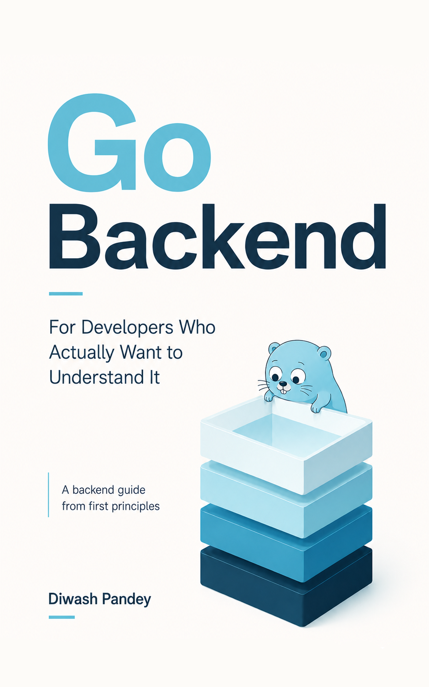

  

# Go Backend: For Developers Who Actually Want To Understand It
> A free backend guide from first principles — v0.1

Most Go resources teach you how to USE it.
This one teaches you how it actually WORKS underneath.

## 📥 Download Free
[Download PDF](./Go_Backend_First_Principles_Book.pdf)

## Who is this for?
Backend developers from other languages migrating to Go
who want to understand it, not just memorize it.

## What's inside
- How a Go web server actually works
- Request Lifecycle from TCP up
- HTTP, Headers, Body, Cookies, Middleware
- Database Integration
- JWT Authentication
- Logging, Testing, and more

